---
## Front matter
title: "Лабораторная работа №2"
author: "Рогозин Игорь Андреевич"

## Generic otions
lang: ru-RU
toc-title: "Содержание"

## Bibliography
bibliography: bib/cite.bib
csl: pandoc/csl/gost-r-7-0-5-2008-numeric.csl

## Pdf output format
toc: true # Table of contents
toc-depth: 2
lof: true # List of figures
lot: true # List of tables
fontsize: 12pt
linestretch: 1.5
papersize: a4
documentclass: scrreprt
## I18n polyglossia
polyglossia-lang:
  name: russian
  options:
	- spelling=modern
	- babelshorthands=true
polyglossia-otherlangs:
  name: english
## I18n babel
babel-lang: russian
babel-otherlangs: english
## Fonts
mainfont: PT Serif
romanfont: PT Serif
sansfont: PT Sans
monofont: PT Mono
mainfontoptions: Ligatures=TeX
romanfontoptions: Ligatures=TeX
sansfontoptions: Ligatures=TeX,Scale=MatchLowercase
monofontoptions: Scale=MatchLowercase,Scale=0.9
## Biblatex
biblatex: true
biblio-style: "gost-numeric"
biblatexoptions:
  - parentracker=true
  - backend=biber
  - hyperref=auto
  - language=auto
  - autolang=other*
  - citestyle=gost-numeric
## Pandoc-crossref LaTeX customization
figureTitle: "Рис."
tableTitle: "Таблица"
listingTitle: "Листинг"
lofTitle: "Список иллюстраций"
lotTitle: "Список таблиц"
lolTitle: "Листинги"
## Misc options
indent: true
header-includes:
  - \usepackage{indentfirst}
  - \usepackage{float} # keep figures where there are in the text
  - \floatplacement{figure}{H} # keep figures where there are in the text
---

# Цель работы

Целью работы является освоение процедуры оформления отчетов с помощью легковесного
языка разметки Markdown.

# Задание

1. Создайте отчет по выполнению
лабораторной работы в
соответствующем каталоге рабочего
пространства (labs>lab02>report).
2. Скопируйте отчеты по выполнению
предыдущих лабораторных работ в
соответствующие каталоги
созданного рабочего пространства.
3. Загрузите файлы на github.

# Теоретическое введение

Системы контроля версий (Version Control System, VCS) применяются при работе нескольких человек над одним проектом. Обычно основное дерево проекта хранится в
локальном или удалённом репозитории, к которому настроен доступ для участников проекта. При внесении изменений в содержание проекта система контроля версий позволяет их фиксировать, совмещать изменения, произведённые разными участниками проекта, производить откат к любой более ранней версии проекта, если это требуется. Системы контроля версий поддерживают возможность отслеживания и разрешения конфликтов, которые могут возникнуть при работе нескольких человек над одним файлом. Можно объединить (слить) изменения,сделанные разными участниками (автоматически или вручную), вручную выбрать нужную версию, отменить
изменения вовсе или заблокировать файлы для изменения. В зависимости от настроек блокировка не позволяет другим пользователям получить рабочую копию или препятствует изменению рабочей копии файла средствами файловой системы ОС, обеспечивая таким образом, привилегированный доступ только одному пользователю, работающему с файлом. Среди классических VCS наиболее известны CVS, Subversion, а среди распределённых — Git, Bazaar, Mercurial.

Понятия в VCS:
Хранилище – это система, которая позволяет хранить все версии существовавших файлов.
Commit – запись изменений.
История – список изменений раннее.
Рабочая копия – копия файла, с которой активно
ведется работа.
В классических системах контроля версий используется централизованная модель,предполагающая наличие единого репозитория для хранения файлов. Выполнение большинства функций по управлению версиями осуществляется специальным сервером. Децентрализованная VCS предназначена для обработки ветвлений и слияний как части своей ДНК, сохраняя указатель на предыдущий коммит в каждом коммите, поэтому любое изменение можно отследить до общего предка.
Система контроля версий Git представляет собой набор программ командной строки. Доступ к ним
можно получить из терминала посредством ввода команды git с различными опциями. Благодаря
тому, что Git является распределённой системой контроля версий, резервную копию локального
хранилища можно сделать простым копированием или архивацией.

# Выполнение лабораторной работы

# Начало
1. Откройте терминал

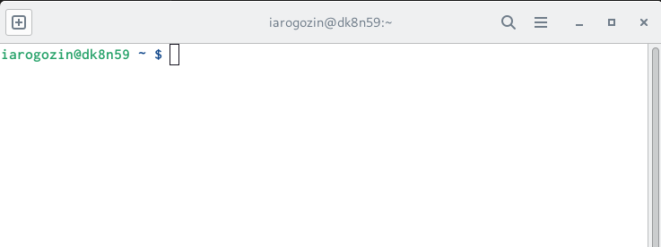{#fig:001 width=70%}

2. После создания аккаунта на сайте [link text](https://github.com/) сделаем предварительную конфигурацию git.
Вводим в консоль команды, указав имя и email
владельца репозитория:

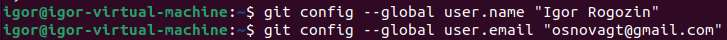

3. Настроим utf-8 в выводе сообщений git:

4. Зададим имя начальной ветки (будем называть её master):

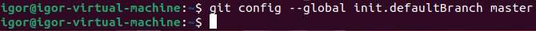

5. Зададим параметры:
Параметр autocrlf:
Параметр safecrlf:

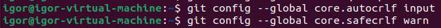

#  Создание SSH ключа

1. Теперь для последующей идентификации пользователя на сервере репозиториев необходимо
сгенерировать пару ключей (приватный и открытый):

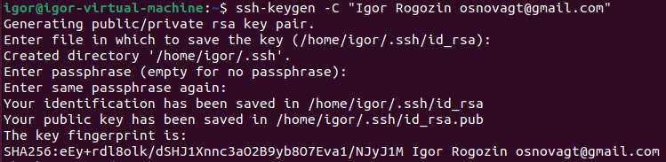

2. Далее загрузим сгенерированный ключ на github.
Для этого зайти на сайт http://github.com/ под своей учётной записью и перейти в меню Settings. После этого выбрать в боковом меню SSH and GPG keys.
Перейдём в подкаталог Документы домашнего каталога указав относительный путь:

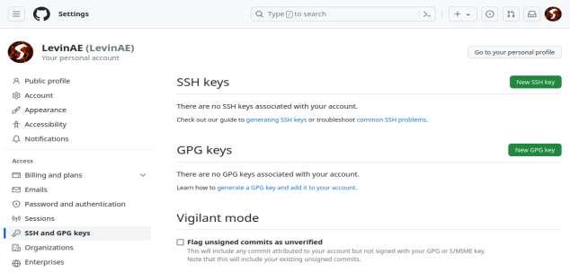

3. Копируем ключ с помощью команды cat
~/.ssh/id_rsa.pub | xclip -sel clip и вставляем ключ в появившееся на сайте поле и указываем для ключа имя (Title). Нажимаем кнопку Add SSH Key

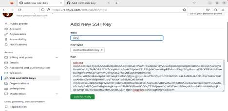

# Создание рабочего пространства и репозитория курса на основе шаблона

1. Откроем терминал и создадим каталог для предмета
«Архитектура компьютера»:

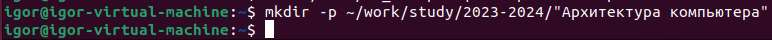

Репозиторий на основе шаблона можно создать через web-
интерфейс github.

2. Перейдём на станицу репозитория с шаблоном курса
[link text](https://github.com/yamadharma/cour se-directory-student-template). Далее выберите Use this template.

3. В открывшемся окне задайте имя репозитория (Repository name) study_2023–2024_arhpc и создайте репозиторий (кнопка Create repository from template).

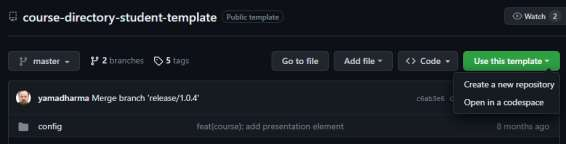

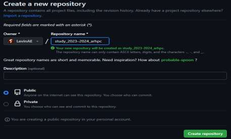

4. Теперь зайдём в терминал и
перейдём в каталог курса:

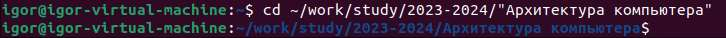

И клонируем созданный репозиторий:
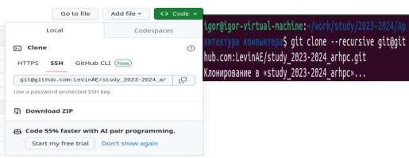

# Настройка каталога курса

1. Для начала перейдём в каталог курса:

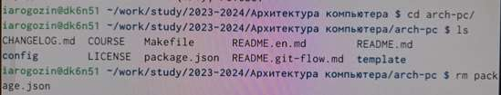

2. Создадим необходимые каталоги:

3. После этого отправим все изменения на
сервер

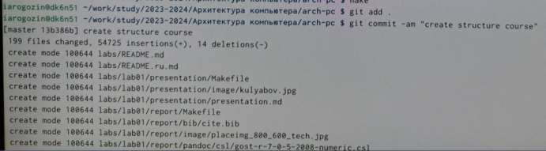

# Задание для самостоятельной работы

1. Создайте отчет по выполнению
лабораторной работы в соответствующем
каталоге рабочего пространства
(labs>lab02>report).

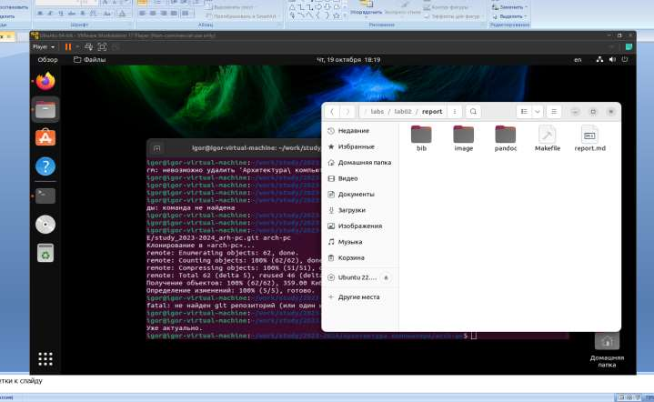

2. Скопируйте отчеты по
выполнению предыдущих
лабораторных работ в
соответствующие каталоги
созданного рабочего
пространства.

3. Загрузите файлы на github

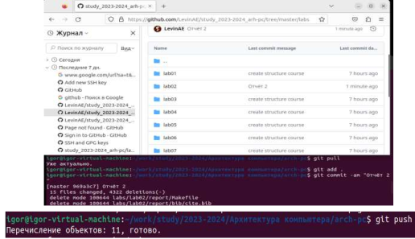

# Выводы

Сегодня я научился работать с github и сохранять, а затем загружать отчёты в
репозиторий.
