---
## Front matter
title: "Лабораторная работа №4"
author: "Рогозин Игорь Андреевич"

## Generic otions
lang: ru-RU
toc-title: "Содержание"

## Bibliography
bibliography: bib/cite.bib
csl: pandoc/csl/gost-r-7-0-5-2008-numeric.csl

## Pdf output format
toc: true # Table of contents
toc-depth: 2
lof: true # List of figures
lot: true # List of tables
fontsize: 12pt
linestretch: 1.5
papersize: a4
documentclass: scrreprt
## I18n polyglossia
polyglossia-lang:
  name: russian
  options:
	- spelling=modern
	- babelshorthands=true
polyglossia-otherlangs:
  name: english
## I18n babel
babel-lang: russian
babel-otherlangs: english
## Fonts
mainfont: PT Serif
romanfont: PT Serif
sansfont: PT Sans
monofont: PT Mono
mainfontoptions: Ligatures=TeX
romanfontoptions: Ligatures=TeX
sansfontoptions: Ligatures=TeX,Scale=MatchLowercase
monofontoptions: Scale=MatchLowercase,Scale=0.9
## Biblatex
biblatex: true
biblio-style: "gost-numeric"
biblatexoptions:
  - parentracker=true
  - backend=biber
  - hyperref=auto
  - language=auto
  - autolang=other*
  - citestyle=gost-numeric
## Pandoc-crossref LaTeX customization
figureTitle: "Рис."
tableTitle: "Таблица"
listingTitle: "Листинг"
lofTitle: "Список иллюстраций"
lotTitle: "Список таблиц"
lolTitle: "Листинги"
## Misc options
indent: true
header-includes:
  - \usepackage{indentfirst}
  - \usepackage{float} # keep figures where there are in the text
  - \floatplacement{figure}{H} # keep figures where there are in the text
---

# Цель работы

Освоение процедуры компиляции и сборки программ, написанных на ассемблере NASM.

# Задание

1. В каталоге ~/work/arch-pc/lab04 с помощью команды cp создайте копию файла
hello.asm с именем lab4.asm
2. С помощью любого текстового редактора внесите изменения в текст программы в
файле lab4.asm так, чтобы вместо Hello world! на экран выводилась строка с вашими
фамилией и именем.
3. Оттранслируйте полученный текст программы lab4.asm в объектный файл. Выполните
компоновку объектного файла и запустите получившийся исполняемый файл.
4. Скопируйте файлы hello.asm и lab4.asm в Ваш локальный репозиторий в ката-
лог ~/work/study/2023-2024/"Архитектура компьютера"/arch-pc/labs/lab04/.
Загрузите файлы на Github

# Теоретическое введение

## Ассемблер и язык ассемблера

Язык ассемблера (assembly language, сокращённо asm) — машинно-ориентированный
язык низкого уровня. Можно считать, что он больше любых других языков приближен к
архитектуре ЭВМ и её аппаратным возможностям, что позволяет получить к ним более
полный доступ, нежели в языках высокого уровня, таких как C/C++, Perl, Python и пр. Заметим,
что получить полный доступ к ресурсам компьютера в современных архитектурах нельзя,
самым низким уровнем работы прикладной программы является обращение напрямую к
ядру операционной системы. Именно на этом уровне и работают программы, написанные
на ассемблере. Но в отличие от языков высокого уровня ассемблерная программа содержит
только тот код, который ввёл программист. Таким образом язык ассемблера — это язык, с
помощью которого понятным для человека образом пишутся команды для процессора.
Следует отметить, что процессор понимает не команды ассемблера, а последовательности
из нулей и единиц — машинные коды. До появления языков ассемблера программистам
приходилось писать программы, используя только лишь машинные коды, которые были
крайне сложны для запоминания, так как представляли собой числа, записанные в двоичной
или шестнадцатеричной системе счисления. Преобразование или трансляция команд с языка ассемблера в исполняемый машинный код осуществляется специальной программой транслятором — Ассемблер.
Программы, написанные на языке ассемблера, не уступают в качестве и скорости програм-
мам, написанным на машинном языке, так как транслятор просто переводит мнемонические
обозначения команд в последовательности бит (нулей и единиц).
Используемые мнемоники обычно одинаковы для всех процессоров одной архитектуры
или семейства архитектур (среди широко известных — мнемоники процессоров и контрол-
леров x86, ARM, SPARC, PowerPC,M68k). Таким образом для каждой архитектуры существует
свой ассемблер и, соответственно, свой язык ассемблера.
Наиболее распространёнными ассемблерами для архитектуры x86 являются:
• для DOS/Windows: Borland Turbo Assembler (TASM), Microsoft Macro Assembler (MASM) и
Watcom assembler (WASM);
• для GNU/Linux: gas (GNU Assembler), использующий AT&T-синтаксис, в отличие от
большинства других популярных ассемблеров, которые используют Intel-синтаксис.
Более подробно о языке ассемблера см., например, в [10].
В нашем курсе будет использоваться ассемблер NASM (Netwide Assembler) [7; 12; 14].
NASM — это открытый проект ассемблера, версии которого доступны под различные
операционные системы и который позволяет получать объектные файлы для этих систем. В
NASM используется Intel-синтаксис и поддерживаются инструкции x86-64.
Типичный формат записи команд NASM имеет вид:
[метка:] мнемокод [операнд {, операнд}] [; комментарий]

В процессе создания ассемблерной программы можно выделить четыре шага:
• Набор текста программы в текстовом редакторе и сохранение её в отдельном файле.
Каждый файл имеет свой тип (или расширение), который определяет назначение файла.
Файлы с исходным текстом программ на языке ассемблера имеют тип asm.
• Трансляция — преобразование с помощью транслятора, например nasm, текста про-
граммы в машинный код, называемый объектным. На данном этапе также может быть
получен листинг программы, содержащий кроме текста программы различную допол-
нительную информацию, созданную транслятором. Тип объектного файла — o, файла
листинга — lst.
• Компоновка или линковка — этап обработки объектного кода компоновщиком (ld),
который принимает на вход объектные файлы и собирает по ним исполняемый файл.
Исполняемый файл обычно не имеет расширения. Кроме того, можно получить файл
карты загрузки программы в ОЗУ, имеющий расширение map.
• Запуск программы. Конечной целью является работоспособный исполняемый файл.
Ошибки на предыдущих этапах могут привести к некорректной работе программы,
поэтому может присутствовать этап отладки программы при помощи специальной
программы — отладчика. При нахождении ошибки необходимо провести коррекцию
программы, начиная с первого шага.
Из-за специфики программирования, а также по традиции для создания программ на язы-
ке ассемблера обычно пользуются утилитами командной строки.

# Выполнение лабораторной работы

## Программа Hello world!

1. Откройте терминал

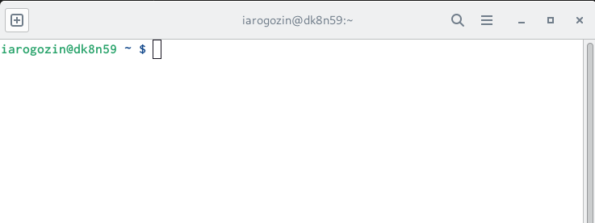{#fig:001 width=70%}

2. Создайте каталог для работы с программами на языке ассемблера NASM:

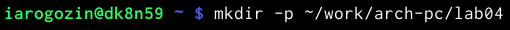{#fig:001 width=70%}

Перейдите в созданный каталог

{#fig:001 width=70%}

Создайте текстовый файл с именем hello.asm

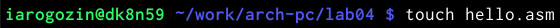{#fig:001 width=70%}

откройте этот файл с помощью любого текстового редактора, например, gedit

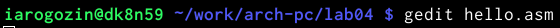{#fig:001 width=70%}

и введите в него следующий текст:

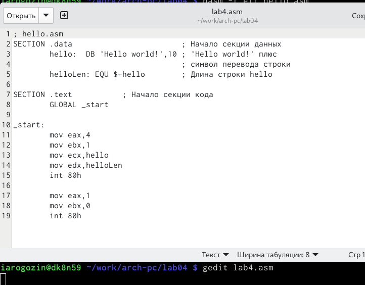{#fig:001 width=70%}

## Транслятор NASM

1. NASM превращает текст программы в объектный код. Например, для компиляции приве-
дённого выше текста программы «Hello World» необходимо написать:

{#fig:001 width=70%}

2. Если текст программы набран без ошибок, то транслятор преобразует текст программы
из файла hello.asm в объектный код, который запишется в файл hello.o. Таким образом,
имена всех файлов получаются из имени входного файла и расширения по умолчанию.
При наличии ошибок объектный файл не создаётся, а после запуска транслятора появятся
сообщения об ошибках или предупреждения.

Проверяем выполнение команды

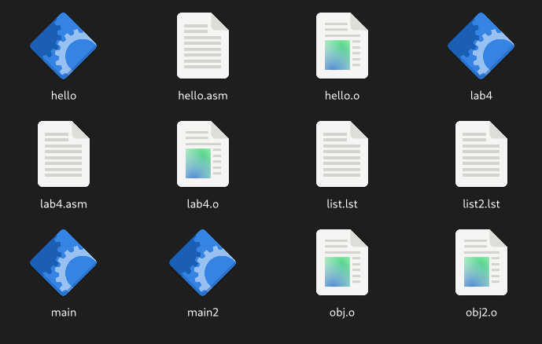{#fig:001 width=70%}

Объектный файл имеет имя: hello.o

## Расширенный синтаксис командной строки NASM

1. Выполните следующую команду:

{#fig:001 width=70%}

Данная команда скомпилирует исходный файл hello.asm в obj.o (опция -o позволяет
задать имя объектного файла, в данном случае obj.o), при этом формат выходного файла
будет elf, и в него будут включены символы для отладки (опция -g), кроме того, будет создан
файл листинга list.lst (опция -l).

Проверьте, что файлы были созданы.

{#fig:001 width=70%}

## Компоновщик LD

1. Чтобы получить исполняемую программу, объектный файл
необходимо передать на обработку компоновщику:

{#fig:001 width=70%}

Проверьте, что исполняемый файл hello был создан

{#fig:001 width=70%}

2. Выполните следующую команду:

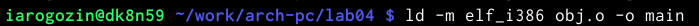{#fig:001 width=70%}

Исполняемый файл будет иметь имя: main

3. Запустить на выполнение созданный исполняемый файл, находящийся в текущем каталоге,
можно, набрав в командной строке:

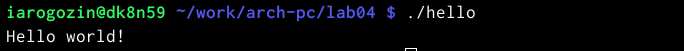{#fig:001 width=70%}

# Задание для самостоятельной работы

1. В каталоге ~/work/arch-pc/lab04 с помощью команды cp создайте копию файла
hello.asm с именем lab4.asm

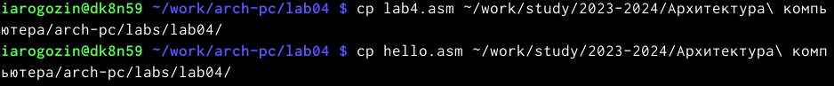{#fig:001 width=70%}

2. С помощью любого текстового редактора внесите изменения в текст программы в
файле lab4.asm так, чтобы вместо Hello world! на экран выводилась строка с вашими
фамилией и именем.

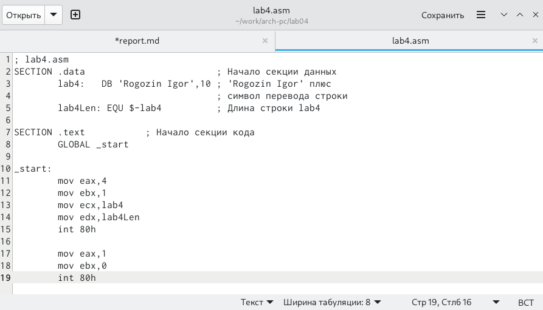{#fig:001 width=70%}

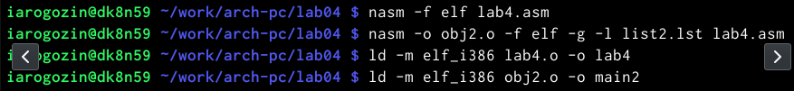{#fig:001 width=70%}

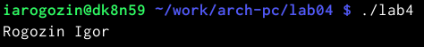{#fig:001 width=70%}

3. Оттранслируйте полученный текст программы lab4.asm в объектный файл. Выполните
компоновку объектного файла и запустите получившийся исполняемый файл.
4. Скопируйте файлы hello.asm и lab4.asm в Ваш локальный репозиторий в ката-
лог ~/work/study/2023-2024/"Архитектура компьютера"/arch-pc/labs/lab04/.
Загрузите файлы на Github.

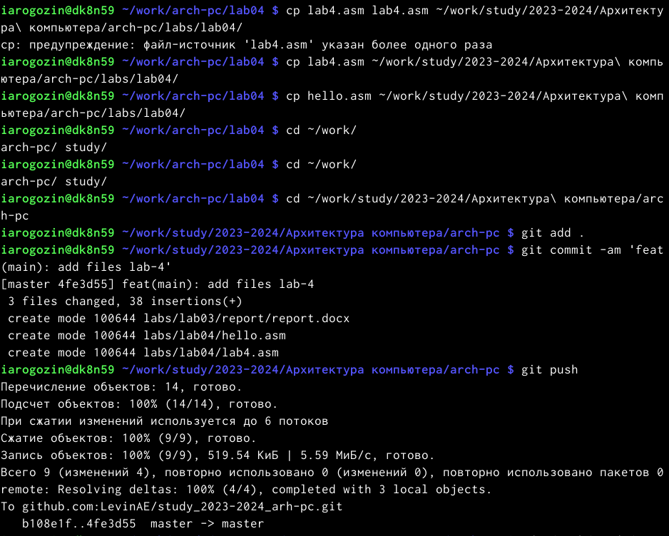{#fig:001 width=70%}

# Выводы

Я научился писать небольшие программы и компилировать их на ассемблере NASM.
