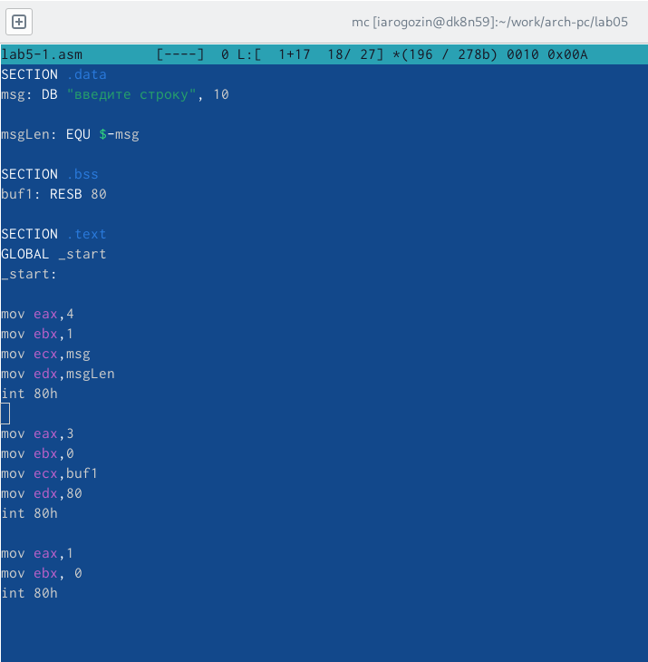

---
## Front matter
title: "Лабораторная работа №5"
author: "Рогозин Игорь Андреевич"

## Generic otions
lang: ru-RU
toc-title: "Содержание"

## Bibliography
bibliography: bib/cite.bib
csl: pandoc/csl/gost-r-7-0-5-2008-numeric.csl

## Pdf output format
toc: true # Table of contents
toc-depth: 2
lof: true # List of figures
lot: true # List of tables
fontsize: 12pt
linestretch: 1.5
papersize: a4
documentclass: scrreprt
## I18n polyglossia
polyglossia-lang:
  name: russian
  options:
	- spelling=modern
	- babelshorthands=true
polyglossia-otherlangs:
  name: english
## I18n babel
babel-lang: russian
babel-otherlangs: english
## Fonts
mainfont: PT Serif
romanfont: PT Serif
sansfont: PT Sans
monofont: PT Mono
mainfontoptions: Ligatures=TeX
romanfontoptions: Ligatures=TeX
sansfontoptions: Ligatures=TeX,Scale=MatchLowercase
monofontoptions: Scale=MatchLowercase,Scale=0.9
## Biblatex
biblatex: true
biblio-style: "gost-numeric"
biblatexoptions:
  - parentracker=true
  - backend=biber
  - hyperref=auto
  - language=auto
  - autolang=other*
  - citestyle=gost-numeric
## Pandoc-crossref LaTeX customization
figureTitle: "Рис."
tableTitle: "Таблица"
listingTitle: "Листинг"
lofTitle: "Список иллюстраций"
lotTitle: "Список таблиц"
lolTitle: "Листинги"
## Misc options
indent: true
header-includes:
  - \usepackage{indentfirst}
  - \usepackage{float} # keep figures where there are in the text
  - \floatplacement{figure}{H} # keep figures where there are in the text
---

# Цель работы

Приобретение практических навыков работы в Midnight Commander. Освоение инструкций
языка ассемблера mov и int.

# Задание

1. Создайте копию файла lab5-1.asm. Внесите изменения в программу (без использова-
ния внешнего файла in_out.asm), так чтобы она работала по следующему алгоритму:
• вывести приглашение типа “Введите строку:”;
• ввести строку с клавиатуры;
• вывести введённую строку на экран.
2. Получите исполняемый файл и проверьте его работу. На приглашение ввести строку
введите свою фамилию.
3. Создайте копию файла lab5-2.asm. Исправьте текст программы с использование под-
программ из внешнего файла in_out.asm, так чтобы она работала по следующему
алгоритму:
• вывести приглашение типа “Введите строку:”;
• ввести строку с клавиатуры;
• вывести введённую строку на экран.
Не забудьте, подключаемый файл in_out.asm должен лежать в том же каталоге, что и
файл с программой, в которой он используется.
4. Создайте исполняемый файл и проверьте его работу.

# Выполнение лабораторной работы

1. Откройте Midnight Commander:

{#fig:001 width=70%}

2. Переходим в каталог ~/work/arch-pc из лаб. работы №4:

3. Создаём папку lab05

{#fig:001 width=70%}

Затем переходим туда

4. Пользуясь строкой ввода и командой touch создайте файл lab5-1.asm

5. С помощью функциональной клавиши F4 откройте файл lab5-1.asm для редактирования во встроенном редакторе. Как правило в качестве встроенного редактора Midnight

6. Введите текст программы из листинга 5.1 (можно без комментариев), сохраните изме-
нения и закройте файл.

{#fig:001 width=70%}

7. Откройте файл lab5-1.asm для просмотра.

{#fig:001 width=70%}

8. Оттранслируйте текст программы lab5-1.asm в объектный файл. Выполните компоновку объектного файла и запустите получившийся исполняемый файл.

{#fig:001 width=70%}

## Подключение внешнего файла in_out.asm

9. Скачайте файл in_out.asm со страницы курса в ТУИС

{#fig:001 width=70%}

10. Подключаемый файл in_out.asm должен лежать в том же каталоге, что и файл с программой, в которой он используется.

{#fig:001 width=70%}

11. Создадим копию файла lab5-1.asm с именем lab5-2.asm

{#fig:001 width=70%}

12. Исправьте текст программы в файле lab5-2.asm с использование подпрограмм из внешнего файла in_out.asm 

{#fig:001 width=70%}

13. В файле lab5-2.asm замените подпрограмму sprintLF на sprint. 

{#fig:001 width=70%}

{#fig:001 width=70%}

Разница в том, что в первой случае после выполнения программы, командная строка переносится на следующую в отличие от второй.

# Задание для самостоятельной работы

1. Создайте копию файла lab5-1.asm. Внесите изменения в программу (без использова-
ния внешнего файла in_out.asm), так чтобы она работала по следующему алгоритму:
• вывести приглашение типа “Введите строку:”;
• ввести строку с клавиатуры;
• вывести введённую строку на экран.

{#fig:001 width=70%}

2. Получите исполняемый файл и проверьте его работу. На приглашение ввести строку
введите свою фамилию.

{#fig:001 width=70%}

3. Создайте копию файла lab5-2.asm. Исправьте текст программы с использование под-
программ из внешнего файла in_out.asm, так чтобы она работала по следующему
алгоритму:
• вывести приглашение типа “Введите строку:”;
• ввести строку с клавиатуры;
• вывести введённую строку на экран.
Не забудьте, подключаемый файл in_out.asm должен лежать в том же каталоге, что и
файл с программой, в которой он используется.
4. Создайте исполняемый файл и проверьте его работу.

{#fig:001 width=70%}

{#fig:001 width=70%}

# Выводы

Я научился писать небольшие программы в Midnight Commander с вводом и выводом в консоль и компилировать их на ассемблере NASM.
